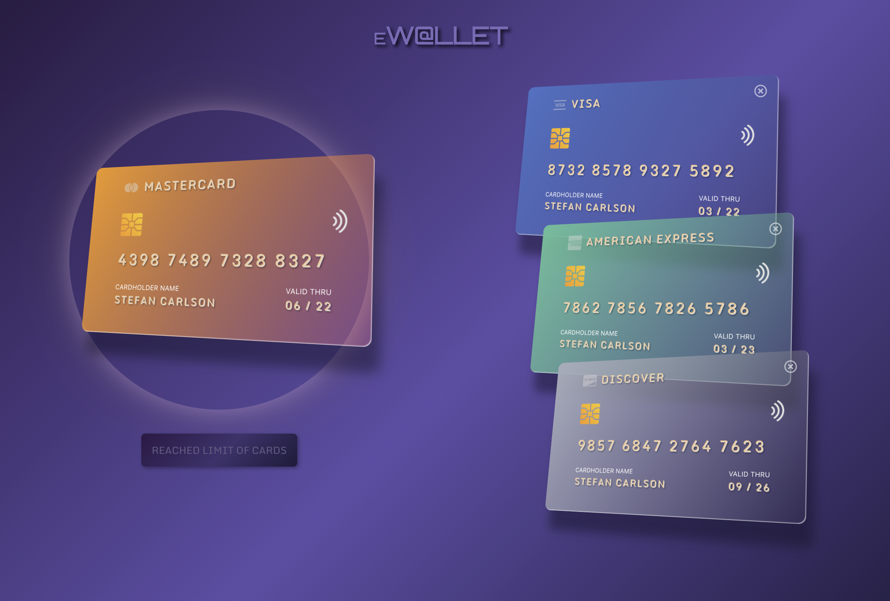

# E-Wallet_React
The task was to create a maximum of 4 credit cards, one that was always active that you could change places with and also be able to remove cards, in addition to the active one. Create a form with inputs that required validation for each input. And that the look would change depending on which card you chose. We had to use Redux and also an api that fetched the same name for all the cards.

* Click the link below to try it out!
* [DEMO](https://creditcard-wallet.netlify.app/)

### Home page:

